# SFIA-Project-2

# Video Game Fortune Teller

### Resources
* Jira: https://ryanwright.atlassian.net/jira/software/projects/M8B/boards/4
* Application: http://35.246.50.113/ 

### Brief

For our task we were set with the objective: 'Create an application that generates “Objects” upon a set of predefined rules.'

### Additional Requirements

* A Kanban Board
* Risk Anaylsis
* Application fully integrated using Feature-Branch model which will be subsequently built via a CI server and deployed to a cloud based machine
* Webhook incorperated so that Jenkins recreates and redeploys changed application
* Project must follow Service-oriented architecture
* Project must be deployed using containerisation and orchestration tool
* Ansible Playbook which will provision the enviornment that app needs to run
* Project must make use of a reverse proxy to make it accessible to user

## Table of Contents

1. [My Approach](#myapproach)
2. [Service 1](#service1)
3. [Service 2](#service2)
4. [Service 3](#service3)
5. [Service 4](#service4)
6. [User Journey](#userjourney)
7. [Risk assessment](#riskassessment)
8. [CI Pipeline](#cipipeline)
9. [Application Front End](#frontend)
10. [Testing](#testing)
11. [Jenkins Pipeline](#jenkinspipeline)
12. [Deployment](#deployment)
13. [Install Instructions](#install)
14. [Furture Improvements](#futureimprovements)

## My Approach 

My initial thought to start off this application would be to build a magic 8 ball application as I felt the logic to this could be easily coded. However upon making a simple 8 Ball python application I had discovered that a random object could be created however did not meet the requirements of a multi service system. From this point I had decided I would refactor some of the logic I used for the magic 8 ball and take the project in a different direction.

Below is a screenshot of my Jira board in the magic 8 ball stage.

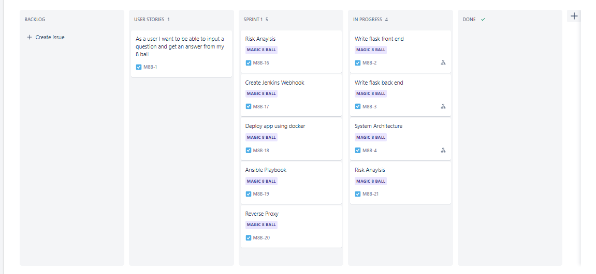

While thinking on the same lines of the 8 Ball I had decided a fortune teller would be allow me to work with a similar idea of the 8 ball I had previously designed while also meeting the project requirements. The new project direction would be a Video Game fortune teller that would make predictions based of a random username generated and from a random game generated from a list. This change in direction meant my previously written code could be refactored in my logic for service 4 with the if-else statement previously written.  

Below is a screenshot of my Jira board after deciding on a video game fortune teller.

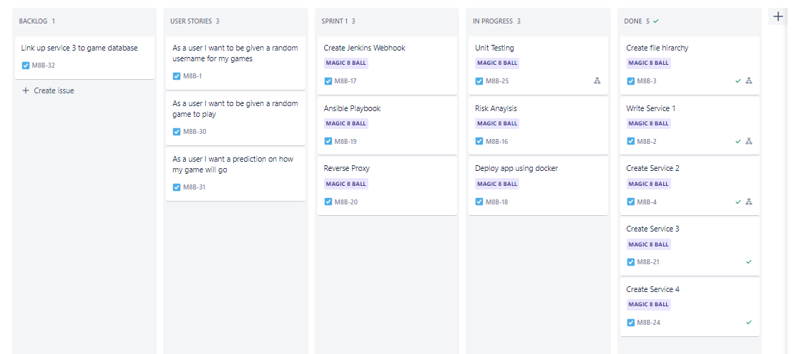

My first steps now were to build services 1 2 & 3 so random objects could be created and the user would have an interface to use the application. 

## Service 1 

This is will be the only service which will be linked to all services. This service will allow for the interface to be rendered as well as using get methods to obtain the objects generated from services 2 and 3 and then pass these through the post method to service 4.  To pass the data gathered from service 1 to service 4 I have merged the outputs from service 2 and 3 and separated them in this 1 string by a comma.

## Service 2 

This a random username generator service. This service was created with the random-username python function. This function will generate a random username consisting off 2 random words followed by a number. This function will provide me with the opportunity to base logic off the number which is at the end of the username

## Service 3 

This is a random game generator service. Currently the list consists of 3 games in a list and uses the python function randint to select a random game from the list. In later versions of this application I would like to include more games and to have this coming from a SQL database which would contain more information however due to time constraints I have chosen just to keep this as a list so I can concentrate on other aspects of the project.

## Service 4 

This service will take the information sent by the post request in service 1 and then split the string by the comma that was inserted. Once the username and game have been split up the ending digit in the username can now be assigned to a variable and used together with the game that was generated to produce an answer based of the logic defined in this service.

## User Journey 

Please find below a diagram marking out the processes behind the user journey:

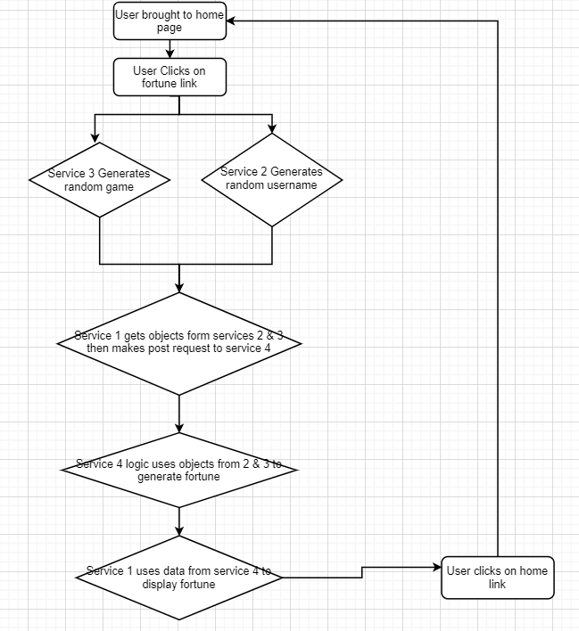

## Risk Assessment 

Please find below a link to my risk assessment:

https://docs.google.com/spreadsheets/d/1gG5lGN77Ml31YEPMjT5ALfbFS7uHnv1-dHHh0SylkgM/edit#gid=0

## CI Pipeline 

Please find below an image of my CI pipeline:

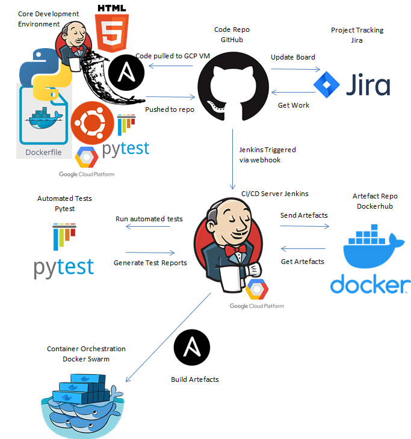

## Application Front End 

Please find below an image of my home page:
 
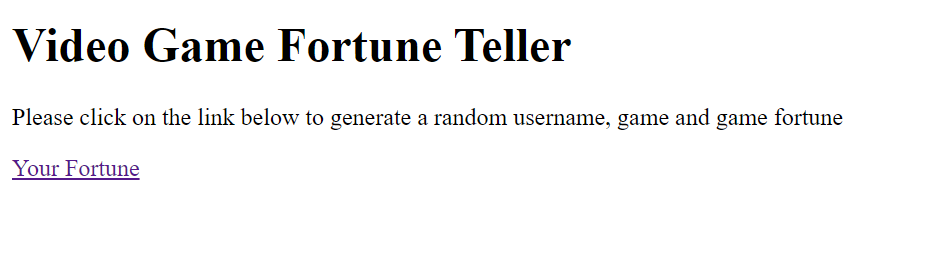

Please find below and image of my fortune page:

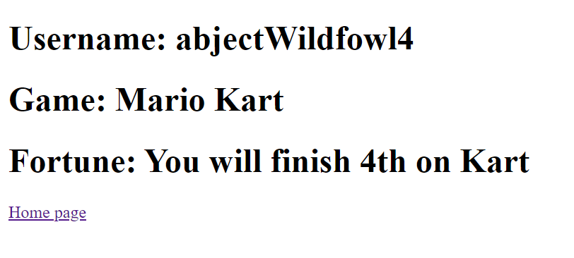

## Testing 

My Unit testing achieved 100% coverage across all services. For service 1 I tested that the home page was accessible by sending a get request to the home route and asserting that my response code would be 200. To test the prediction function in this isolated environment the patch function was imported from the unitest.mock module to allow me to assert values to the get and post requests made to the other services without making requests to them.

Below is an output from pytest when ran on service 1

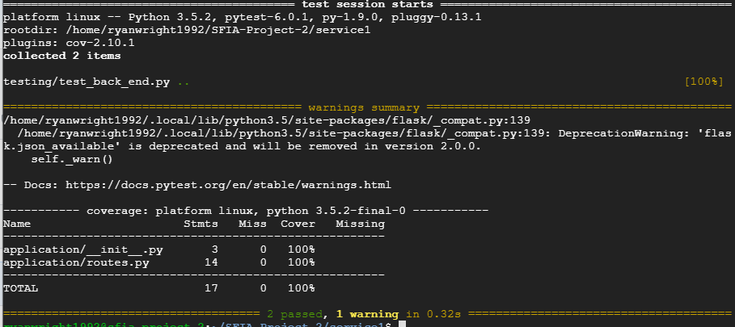

For services 2 and 3 I decided to test through a get request with a 200 response code qualifying for a successful test. 

Below is an output from pytest when ran on service 2

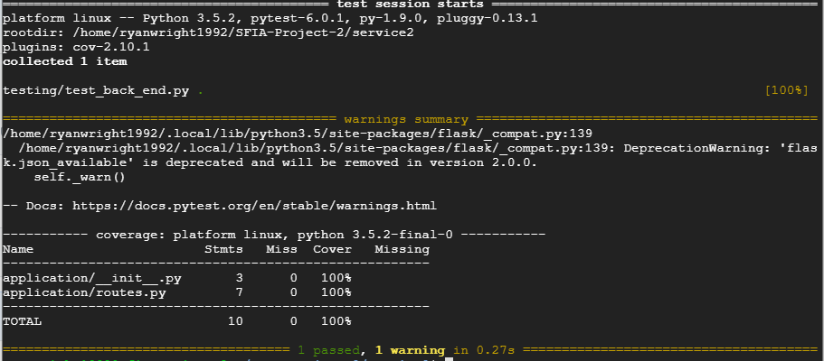

Below is an output from pytest when ran on service 3

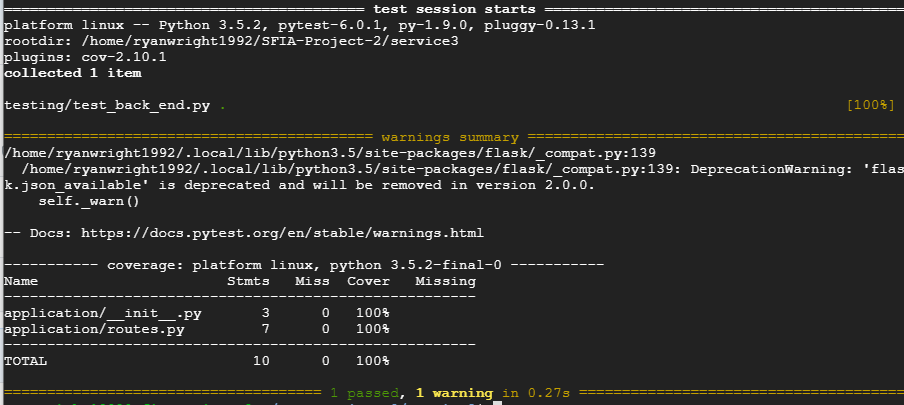

For my first service 4 test I had used a post request with a 200 response code would show that the function is working correctly when data is passed through it. To test the logic of the if else statement I had made a test for each statement asserting that part of the expected response should be in the response data with certain data being passed through.

Below is an output from pytest when ran on service 4

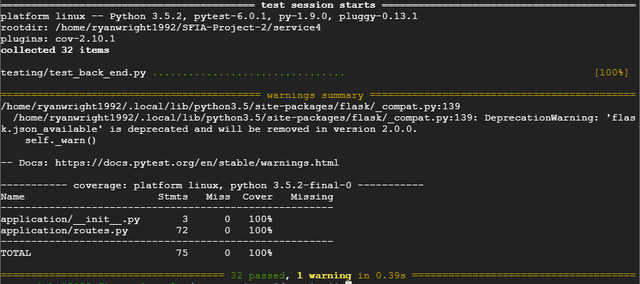

For this application I decided these back end tests at 100% coverage would be satisfactory as the only other parts that would need tested are my 2 links which were shown to be functional when their routes were tested in service 1 tests. However when more functionality is added to this application this integration testing will need to be incorporated further.

These tests were carried out manually through the development process by running pytest in each of my services while in my vm.  These tests where later incorporated to be run automatically via my Jenkins pipeline. 

## Jenkins Pipeline 

Here is a screen shot from my Jenkins pipeline which is built from my Jenkinsfile:

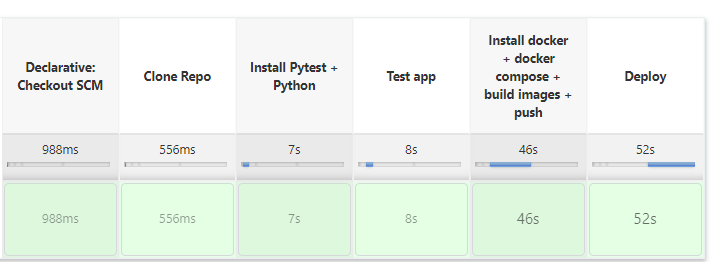

Initially I had put the test stage after the Install docker stage however as the docker stage developed to push images to dockerhub I decided that the testing stage would be better carried out before the docker stage as it would not be good practise to push images to dockerhub which could potentially fail.

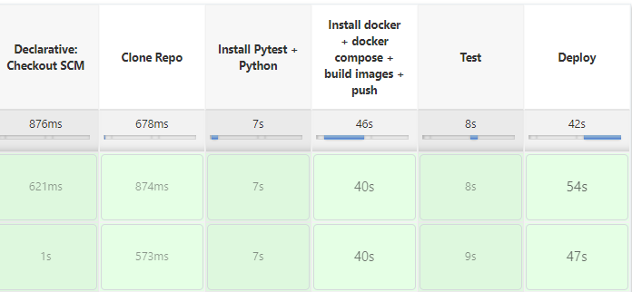

## Deployment 

This app will be deployed using docker swarm. Its current configuration is set up for 1 master and one worker. The application will build an image of each service using their respective dockerfiles through Jenkins and the images will then be uploaded to dockerhub. These images will be called later in the ansible playbook which is run after successful tests.

Initially setting up the deployment the swarm master was found not to have load balanced properly and not correctly deploying services across the worker. To combat this I had decided to make the master prune during initial set up aswell as draining the worker and making them leave the swarm before rejoining. This has added sometime onto the pipeline but getting a working product was priority at this time.

## Install Instructions 

To allow for this application to run a VM will be required with the following set up:

* Jenkins Installed
* Jenkins user logged into dockerhub
* Ansible installed

Two other empty VM’s will be required to run the docker master and worker.

To allow Jenkins to communicate with other VMs it’s ssh key will be required. Once logged in as the Jenkins user you will need to use ssh-keygen to allow you produce your public key. To obtain the public key type ’cat ~/.ssh/id_rsa.pub’ into the command line and copy the output to your other empty VM’s ssh keys.

If setting up for first time on a brand new machine line 6 of the Jenkinsfile will need to be changed from git fetch to git clone. Once the repo has been cloned down once we can change this back to git fetch. 

A firewall rule will also need to be implemented on the VM’s to be used to run that application which will open up ports 5000-5005

To add further vms to be run the Jenkins file will need IP addresses added to the docker worker section in the inventory file and a new configuration will need added to the roles/dockerwoker/tasks/main.yaml file.

For first time setting up lines 6-19 will not be required in the playbook.yaml file. However these lines will be required from the second set up onwards. 

This application will also require Jenkins to log into dockerhub to push changes that are made. If this information is required please email me on ryanwright1992@gmail.com and I can assist.

## Future Improvements 

* Advertise address, remote address and join token to be coded as variables rather than being hard coded into system.
* SQL Database to be incorporated for games generator with further information on games.
* Automated Integration testing to be incorporated.
* Front end overhaul with CSS
